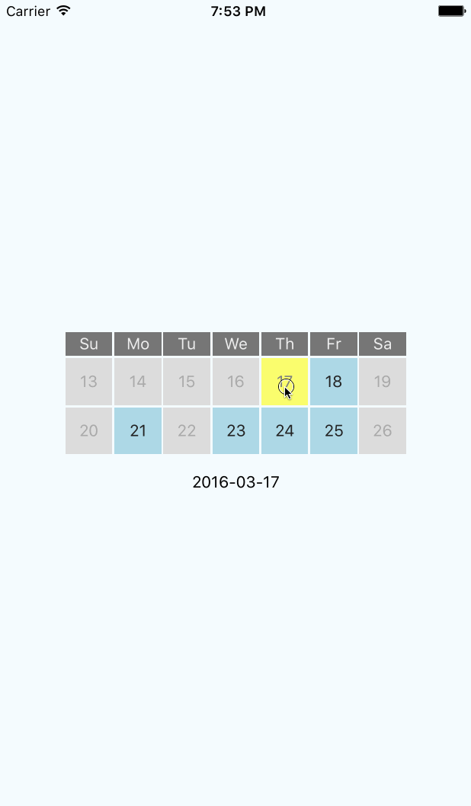

# react-native-minicalendar

Simple mini calendar or date picker for React Native

## Installation

`npm install react-native-minicalendar --save`

## Usage

### Example:

```js
<MiniCalendar
  showDayHeading={true}
  dayHeadings={['Su','Mo','Tu','We','Th','Fr','Sa']}
  onDateSelect={::this.onDateSelect}
  startDate={moment().format('YYYY-MM-DD')}
  selectedDate={moment(this.state.selectedDate).format('YYYY-MM-DD')}
  numberOfDaysToShow={7}
  enabledDaysOfTheWeek={['Mo','We','Fr']}
  isoWeek={false}
  disablePreviousDays={true}
  disableToday={false}
  headingStyle={{backgroundColor: 'blue'}}
  activeDayStyle={{backgroundColor: 'lightblue', color: 'white'}}
  disabledDayStyle={{backgroundColor: 'grey', color: 'darkgrey'}}
  selectedDayStyle={{backgroundColor: 'goldenrod'}}
/>
```

### Demo:


Thanks to @license2e and the React Native community for the assistance.
MIT Licensed
